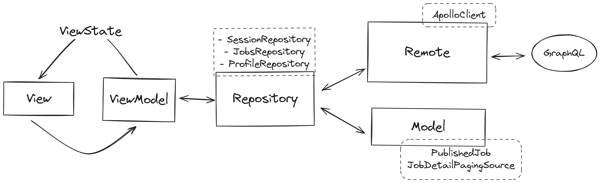

# SeekMax Android Tech Assessment

# Context

This project is an Android tech assessment undertaken using the Kotlin programming language and Jetpack Compose framework. Jetpack Compose was chosen for its declarative UI approach, aligning with current industry trends. While this project marks my first experience with Jetpack Compose and integrating GraphQL, it's essential to note that the implementation is not production-ready.

Some features remain incomplete due to time constraints, as outlined below:

### Did Not Manage to Do

- Add a search bar and filter for the current jobs list.
- Display a list of job applications made by the authenticated user.
- Implement additional functionality to change user profile attributes (e.g., name, email, etc.).
- Others which marked as `TODO` in the codebase.

# Architecture
The project follows the Model View ViewModel architecture, with repository pattern in Jetpack Compose. 


# Project Structure
```markdown
├───io.limkhashing.seekmax
│   ├───**core**
│   │   ├───manager
│   │   │    └───*Manager.kt
│   │   └───Other core files
│   ├───**data**
│   │   ├───paging
│   │   ├───repository
│   │   └───*Mapper.kt
│   ├───**di**
│   │   └───module
│   │        └───*Module.kt
│   ├───**domain**
│   │   ├───model
│   │   ├───repository
│   │   │    └───sub-feature(s)
│   │                └───*Repository.kt
│   ├───**helper**
│   │   └───*Helper.kt
│   ├───**navigation**
│   │   └───graph
│   │        └───*Graph.kt
│   ├───**network**
│   │   └───*Interceptors.kt
│   │───**presentation**
│   │   │───*State.kt
│   │   └───sub-feature(s)
│   │        └───*Screen.kt
│   │        └───*ViewModel.kt
```

# Navigation Graph


# Functional Requirements

### Basic

- **Login:** Users can log in with their username and password. Upon successful login, a JWT is stored and used in subsequent request headers.
- **Logout:** Users can log out, deleting the stored JWT and returning to the login screen.

### Jobs

- **Job List:** Displays a paginated list of active job ads, where the status is `PUBLISHED` (Refering to `/design/JobList.png` for a sample design)
- **Job Details:** Displays the details of a selected job. Upon applying, the selected job will be marked as `Applied`
- **Search:** Implementation is pending due to time constraints and requires backend work.

### My Applications

- **Show Applications:** Displays all applications made by the authenticated user. This feature requires a new backend endpoint, pending implementation due to time constraints.

### My Profile

- **Profile Adjustment:** Candidates can adjust profile attributes. Currently, only the password change feature is available. Other attributes are pending implementation due to time constraints.
- **Change Password:** Requires backend work, which done in `backend/rest/src/api/changepassword/index.ts`

# Testing

### Unit Testing
Unit tests for ViewModel can be found in `app/src/test`. To run the tests, use the following command:
```bash
./gradlew test
```

### Instrumented Testing
Instrumented tests for Screens can be found in `app/src/androidTest`. Due to time constraints, only LoginScreen has been tested.